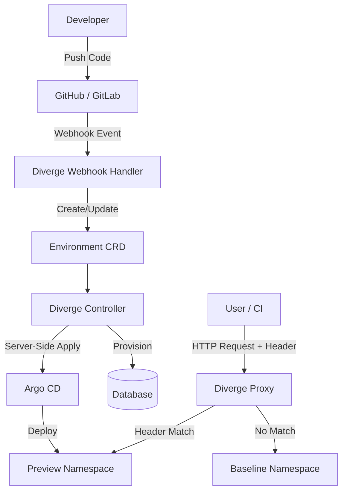

Diverge is a Kubernetes-native engine that uses a single consolidated Docker image containing multiple binaries. 

## Components

1. **Controller**: The brain of Diverge. A standard Kubernetes operator that watches the `Environment` CRD. It manages the lifecycle of preview environments, directly creates Argo CD `Application` CRs via Server-Side Apply, handles database provisioning, and ensures clean finalizer-based teardowns.
2. **Proxy**: A lightweight layer-7 router that intercepts traffic, inspects RFC 7230 compliant headers, and dynamically routes requests to either the preview namespace or the shared baseline.
3. **Webhook Handler**: An HTTP server that securely processes incoming GitHub and GitLab webhooks, executing strict payload validation before triggering the controller.
4. **CLI**: A robust developer tool (`diverge`) for creating, validating, and managing environments locally.

## Security Architecture Highlights

Diverge is built with a **Security First** mindset:
- **RBAC-Scoped Client**: The controller operates with the minimum required permissions necessary to manage specific namespaces and resources.
- **Constant-Time Secret Comparison**: Webhook secrets are validated securely to prevent timing attacks.
- **Path Traversal Prevention**: Input validation guards against directory traversal in GitHub/GitLab webhook handling.
- **Shell/Markdown Injection Prevention**: All templates and outputs are sanitized to prevent injection attacks.
- **Strict YAML Unmarshaling**: Configuration parsing uses `DisallowUnknownFields` to prevent misconfigurations or tampering.
- **Context Timeouts**: All external network calls enforce strict context timeouts.

## Flow Diagram

