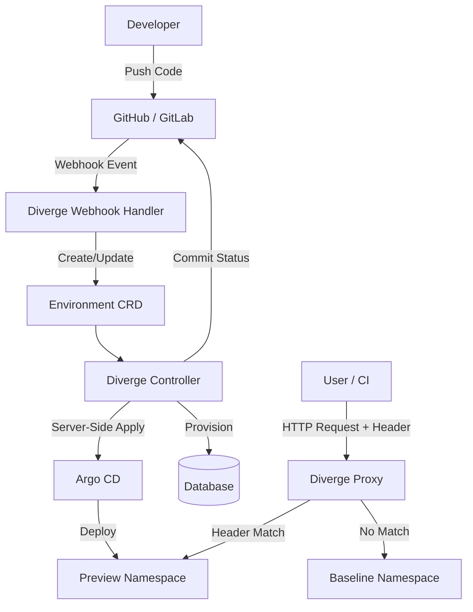

Diverge is a Kubernetes-native engine that uses a single consolidated Docker image containing multiple binaries. 

## Components

1. **Controller**: The brain of Diverge. A standard Kubernetes operator that watches the `Environment` and `PreviewGroup` CRDs. It manages the lifecycle of preview environments, directly creates Argo CD `Application` CRs via Server-Side Apply, handles database provisioning, and ensures clean finalizer-based teardowns.
2. **Proxy**: A lightweight layer-7 router that intercepts traffic, inspects RFC 7230 compliant headers, and dynamically routes requests to either the preview namespace or the shared baseline.
3. **Activator Proxy**: A specialized reverse proxy that sits in front of scaled-to-zero preview environments. It tracks ready pods via a shared informer, routes to active pods directly, and falls back to the Knative activator to wake up dormant environments on-demand.
4. **Webhook Handler**: An HTTP server that securely processes incoming GitHub and GitLab webhooks, executing strict payload validation before triggering the controller.
5. **CLI**: A robust developer tool (`diverge`) for creating, validating, and managing environments locally.
6. **Status Reporter**: Posts commit status checks (`diverge/preview`) to GitLab and GitHub for merge gating. Validates commit SHAs against a hex-only regex to prevent path traversal.

## Security Architecture Highlights

Diverge is built with a **Security First** mindset:
- **RBAC-Scoped Client**: The controller operates with the minimum required permissions necessary to manage specific namespaces and resources.
- **Constant-Time Secret Comparison**: Webhook secrets are validated securely to prevent timing attacks.
- **Path Traversal Prevention**: Input validation guards against directory traversal in GitHub/GitLab webhook handling.
- **Shell/Markdown Injection Prevention**: All templates and outputs are sanitized to prevent injection attacks.
- **Strict YAML Unmarshaling**: Configuration parsing uses `DisallowUnknownFields` to prevent misconfigurations or tampering.
- **Context Timeouts**: All external network calls enforce strict context timeouts.
- **SHA Validation**: Commit SHAs are validated against a hex-only regex before use in API URLs.
- **Label Validation**: Namespace label keys/values are validated using Kubernetes validation utilities.
- **SQL Injection Prevention**: Schema names use regex-gated validation since parameterized DDL isn't possible.

## Async Routing Architecture

To handle non-HTTP workloads, Diverge creates dedicated infrastructure (e.g., Kafka topics) per preview environment. Configuration is injected into the pods, ensuring strict isolation of asynchronous message flows.

## SDK Context Propagation

Diverge SDKs propagate the necessary routing context (like headers) through background threads and inter-service calls, ensuring the entire request lifecycle remains within the intended environment.

## Server Metrics Collection

The Diverge Server exposes a rich set of Prometheus metrics (e.g., `diverge_server_rpc_requests_total`) and health endpoints, allowing operators to monitor system performance and set up alerting.

## Flow Diagram

