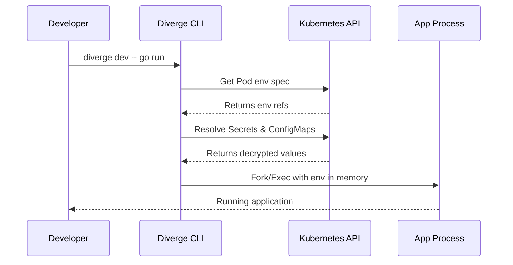

Every developer tool today has a `.env` problem. Whether it's `.env`, `.env.local`, or `.env.something-else`, dev tools inevitably want to dump your application's secrets into a plaintext file sitting on your hard drive. 

It's a security nightmare. We've all seen the consequences: secrets leaking into git history, sitting on unencrypted developer laptops, or getting caught up in random backups. When you ask your CISO if you can use a new local dev tool, they look at this `.env` sprawl and immediately say no.

Enterprise security teams—the folks dealing with SOC2, HIPAA, and FedRAMP—routinely block these tools for a reason. The fundamental issue is that development tools treat secrets as static files instead of what they really are: runtime context. 

We realized that to build a secure local development experience for Kubernetes, we couldn't rely on files. So we killed the `.env` file entirely.

## What Others Do

The industry has mostly settled on workarounds rather than solutions. If you look at the landscape of local Kubernetes dev tools, they almost universally rely on secrets written to disk in some form.

| Tool | Approach | The Problem |
|---|---|---|
| **Telepresence** | Volume mounts + env file export | Secrets land in files on disk |
| **docker-compose** | `.env` file mapping | Secrets are plain text files |
| **Tilt / Skaffold** | Build-time env injection | Secrets end up in build context or logs |
| **Doppler / Infisical** | CLI wrappers | Closest to our approach, but still requires another tool |

Each of these approaches introduces friction or security holes. We wanted something better.

## Our Approach: In-Memory Injection

Here's what it looks like when you run a service locally with Diverge:

```bash
diverge dev --service payments -- go run ./cmd/server
```

That's it. Notice what's missing? There are no `.env` files to download, no exports, and no magic wrappers. Under the hood, Diverge is doing something much more sophisticated:

1. **Discovery:** It finds the baseline pod for your service running in the cluster.
2. **Resolution:** It reads the pod's environment specification. This isn't just literal values—it dynamically resolves `SecretKeyRef`, `ConfigMapKeyRef`, and `EnvFrom` directly from the Kubernetes API.
3. **Injection:** It injects these resolved values directly into the child process's memory space. The secrets never touch your hard drive.
4. **Isolation:** It uses process group isolation (`syscall.Setpgid`) to ensure clean teardown when you're done.

Here is how the flow looks:



No `.env` file. No `.gitignore` entry. No SOC2 finding. 

## The Security Model

We built the security model around strict isolation and fail-fast mechanics. 

First, Diverge respects your RBAC. If your local user doesn't have permissions to read a specific secret in the cluster, Diverge crashes immediately. We don't try to silently skip it or provide an empty value. Fail fast, fail loud.

You might be wondering why we don't support something like `diverge dev --env-output eval`. The reason is simple: shell history leaks. If we evaluate secrets into your shell, they end up in your `~/.zsh_history` or `~/.bash_history`. By forcing execution through our wrapper, we keep secrets out of your shell entirely.

We also implemented process group isolation. When you hit `Ctrl-C` to stop your local development session, Diverge sends a signal to the entire process tree. This ensures no orphaned child processes are left running in the background with access to sensitive environment variables.

:::note[Preview Namespaces]
Diverge warns you if it has to pull secrets from a non-preview namespace. We want to ensure you're safely isolated in your preview environment.
:::

Finally, Diverge detects volume-mounted secrets. While we can't inject files into memory the same way we do environment variables, we provide clear warnings about any volume-mounted secrets we can't automatically resolve.

## What About IDE Integration?

"But what about my debugger?" is the first question we hear when we tell people we don't use `.env` files. Don't worry, we've got you covered.

Because Diverge acts as an executable wrapper, it integrates cleanly into any standard IDE.

### VS Code

In VS Code, simply use Diverge as the target executable in your `launch.json`:

```json
{
  "version": "0.2.0",
  "configurations": [
    {
      "name": "Launch Payments Service",
      "type": "go",
      "request": "launch",
      "mode": "exec",
      "program": "diverge",
      "args": ["dev", "--service", "payments", "--", "go", "run", "./cmd/server"]
    }
  ]
}
```

### JetBrains (IntelliJ / GoLand)

For JetBrains IDEs, you can set Diverge up as an External Tool or wrap it in a Run Configuration:

```xml
<component name="ProjectRunConfigurationManager">
  <configuration default="false" name="Run with Diverge" type="GoApplicationRunConfiguration" factoryName="Go Application">
    <module name="payments" />
    <working_directory value="$PROJECT_DIR$" />
    <kind value="PACKAGE" />
    <package value="github.com/divergedev/payments/cmd/server" />
    <directory value="$PROJECT_DIR$" />
    <filePath value="$PROJECT_DIR$/cmd/server/main.go" />
    <method v="2">
      <option name="RunConfigurationTask" enabled="true" run_configuration_name="Diverge Setup" run_configuration_type="ShConfigurationType" />
    </method>
  </configuration>
</component>
```

:::tip
Check out our [CLI reference](/guides/cli) for more advanced ways to run Diverge with your favorite tools.
:::

## The Cost Savings Angle

While keeping secrets in-memory is primarily a security win, it's part of a larger philosophy about environment efficiency. 

Because Diverge resolves state dynamically from the cluster, your local environment is always in sync with your preview environment. And thanks to our integration with KEDA, those preview environments scale to zero when you aren't actively using them.

Your preview environments cost $0 when idle. You get the security of in-memory secrets and the cost efficiency of scale-to-zero infrastructure. Learn more about how we do this on our [Scale to Zero](/concepts/scale-to-zero) concepts page.

## Try It

Ready to stop managing `.env` files? You can get started with Diverge today.

```bash
curl -sL https://divergedev.com/install.sh | bash
diverge dev --service my-app -- npm run dev
```

Check out the [Quick Start guide](/getting-started/quickstart) to see it in action, or star us on [GitHub](https://github.com/divergedev/diverge).
