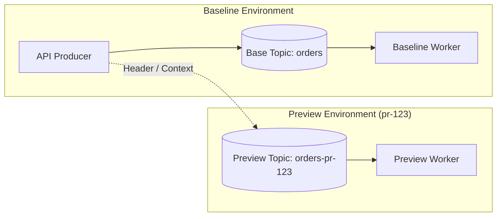

While HTTP routing relies on request headers (such as `x-diverge-env` or `X-Preview-Env`) to steer traffic through Layer 7 gateways, asynchronous and event-driven workloads operate without a centralized HTTP proxy layer.

Diverge provides first-class async routing to isolate message queues, stream processors, and workflow orchestrators across preview environments without noisy-neighbor interference or message race conditions.



## The Challenge

In microservice architectures, services communicate not only through synchronous HTTP/gRPC APIs, but also via asynchronous brokers like Apache Kafka, RabbitMQ, and workflow engines like Temporal.

Routing async workloads to preview environments presents unique architectural challenges:

- **No HTTP Request Headers**: Event streams and message brokers transport binary payloads and custom metadata rather than standard HTTP headers.
- **Nondeterministic Consumer Polling**: If preview workers and baseline workers subscribe to the same topic, consumer group, or task queue, messages intended for preview testing are nondeterministically consumed by the baseline worker (or vice versa).
- **Shared State Contamination**: Preview events processed by production or baseline consumers can trigger unintended state transitions, duplicate billing events, or corrupted shared databases.

## How Diverge Solves Async Routing

Rather than attempting to inspect and multiplex every message on a shared queue in real time, Diverge dynamically provisions **isolated, preview-scoped async resources** when an environment is deployed:

1. **Dynamic Resource Provisioning**: Diverge creates ephemeral topics, consumer groups, or task queues formatted deterministically as `<target>-<env-name>` (e.g., `orders-pr-123`).
2. **Environment Variable Injection**: The controller injects connection details and isolated resource identifiers directly into preview pods at runtime (e.g., `KAFKA_TOPIC`, `KAFKA_CONSUMER_GROUP`, `TEMPORAL_TASK_QUEUE`).
3. **Context and Header Propagation**: Preview producers use lightweight SDK helpers to forward preview context in message metadata, directing downstream workers to the appropriate queues.
4. **Automated Teardown**: When the preview environment expires or its pull request merges, Diverge tears down the ephemeral queues and topics cleanly.

---

## Supported Async Providers

Diverge includes built-in provisioners for popular message brokers and workflow systems, as well as an extensible webhook provider for custom infrastructure.

### 1. Kafka / Event Streams
Compatible with Apache Kafka, AutoMQ, Redpanda, and AWS MSK.

- **Isolation Strategy**: Uses the Kafka AdminClient API to provision preview-specific topics and separate consumer groups.
- **Injected Variables**:
  - `KAFKA_TOPIC`: The isolated topic name (e.g., `payments-pr-123`).
  - `KAFKA_CONSUMER_GROUP`: The isolated consumer group ID (e.g., `payments-pr-123`).
  - `KAFKA_BROKERS`: Comma-separated list of configured broker addresses.
- **Cleanup**: Ephemeral topics created for the preview are safely deleted upon environment teardown.

### 2. Temporal Workflows
Designed for orchestrating distributed workflows and activities.

- **Isolation Strategy**: Generates preview-scoped task queue names (e.g., `order-processing-pr-123`). Because Temporal dynamically provisions task queues upon first worker poll, preview workers immediately bind to their own queues without pre-allocation overhead.
- **Injected Variables**:
  - `TEMPORAL_TASK_QUEUE`: The isolated task queue name.
  - `TEMPORAL_NAMESPACE`: The target Temporal namespace.
- **Cleanup**: When preview workers stop polling, Temporal unloads idle task queues from memory. Diverge's teardown process ensures any pending tasks are drained before the preview environment is removed.

### 3. Webhook (Custom Infrastructure)
For teams utilizing AWS SQS/SNS, Google Cloud Pub/Sub, RabbitMQ, or proprietary in-house brokers.

- **Isolation Strategy**: Diverge issues an HTTP `POST` webhook to your infrastructure provisioning service when a preview environment is created or destroyed.
- **Payload & Response**: The webhook receives the environment metadata and route definition, returning custom environment variable key-value pairs that Diverge injects into the preview containers.

---

## KEDA Auto-Scaling (Scale to Zero)

Running always-on asynchronous workers for dozens of ephemeral preview environments can quickly consume cluster compute and memory resources.

Diverge integrates with **KEDA (Kubernetes Event-driven Autoscaling)** to scale preview workers to zero when no messages or tasks are pending:

- Diverge automatically creates and binds KEDA `ScaledObject` resources to preview worker deployments.
- ScaledObjects monitor the preview-scoped topic lag or task queue backlog.
- When an upstream service publishes an event to `orders-pr-123`, KEDA detects the queue depth and scales the preview worker from 0 to 1 replica.
- Once the queue is drained and the cooldown period elapses, the worker scales back to zero replicas.

---

## SDK Context & Header Propagation

To ensure downstream services route asynchronous messages to the right preview topics or task queues, Diverge provides language SDK helpers:

### Kafka Header Propagation (`pkg/sdk/kafka`)
Injects and extracts the preview environment identifier (`x-diverge-env`) in Kafka record headers:

- **Producers**: Embed the current preview environment tag into outgoing record headers.
- **Consumers**: Extract the environment tag from incoming records to select appropriate downstream processing targets.

### Temporal Context Propagator (`pkg/sdk/temporal`)
Implements the `workflow.ContextPropagator` interface from the Temporal Go SDK:

- Propagates the preview environment identifier across workflow boundaries and child workflows.
- Activities are routed to preview-scoped task queues by setting `ActivityOptions.TaskQueue` to the value of `TEMPORAL_TASK_QUEUE` — the propagator carries the environment context, while task-queue routing is configured separately in your activity options.

---

## Declarative Configuration

Async routes can be defined in both service-level configuration (`.diverge.yaml`) and Kubernetes CRDs.

### Service Configuration (`.diverge.yaml`)

```yaml
# .diverge.yaml in service repository
serviceName: payment-worker
port: 8080
asyncRoutes:
  - protocol: kafka
    target: payment-events
  - protocol: temporal
    target: payment-workflows
```

### Custom Resource Definition (`Environment` CRD)

```yaml
apiVersion: diverge.io/v1alpha1
kind: Environment
metadata:
  name: pr-123
  namespace: diverge
spec:
  source:
    provider: github
    project: myorg/payments
    branch: feature/async-checkout
  routing:
    mode: subdomain
    baseDomain: preview.example.com
    asyncRoutes:
      - protocol: kafka
        target: payment-events
      - protocol: temporal
        target: payment-workflows
        envVarMapping:
          CUSTOM_TASK_QUEUE: "{{ .ResolvedTarget }}"
```

---

## Lifecycle & Status Conditions

The Diverge controller synchronizes async routes during the environment reconciliation loop.

The provisioning state is exposed via the **`AsyncRoutingReady`** condition in the `status.conditions` field of the `Environment` resource:

```yaml
status:
  phase: Running
  conditions:
    - type: AsyncRoutingReady
      status: "True"
      reason: AsyncRoutesProvisioned
      message: "All Kafka topics and Temporal queues successfully provisioned"
      lastTransitionTime: "2026-08-28T22:00:00Z"
```

If provisioning fails (e.g., broker connectivity timeout or webhook error), `AsyncRoutingReady` is set to `False` with the corresponding failure reason.

---

## Slim Builds with Go Build Tags

To reduce binary size and avoid pulling unused client dependencies in resource-constrained controller deployments, Diverge supports compile-time build tags:

- **`no_kafka`**: Excludes Kafka AdminClient dependencies and the Franz-Go library.
- **`no_temporal`**: Excludes Temporal Go SDK dependencies.

```bash
# Build controller without Kafka or Temporal drivers
go build -tags "no_kafka,no_temporal" -o bin/diverge-controller ./cmd/controller
```
