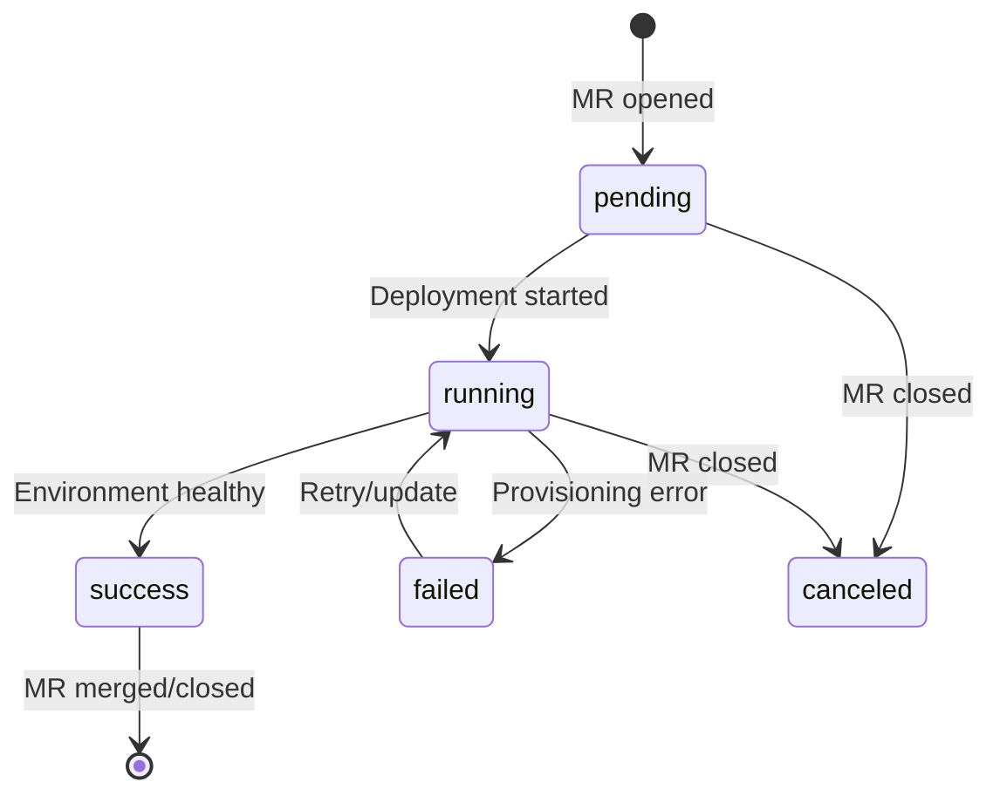

Diverge can post commit status checks to your Git provider, ensuring that merge requests are only mergeable when the preview environment is healthy.

## How It Works

When an MR/PR triggers a preview environment, Diverge posts a `diverge/preview` commit status check to the Git provider. This status reflects the real-time health of the preview environment:

## State Mapping

Diverge uses a unified internal state model that maps to each provider's API:

| Diverge State | GitLab API | GitHub API |
|:---:|:---:|:---:|
| `pending` | `pending` | `pending` |
| `running` | `running` | `pending` |
| `success` | `success` | `success` |
| `failed` | `failed` | `failure` |
| `canceled` | `canceled` | `error` |

## Configuration

Merge gating is enabled automatically when a status reporter is configured. No additional flags are needed beyond the standard notifier setup.

To require the check before merging:

### GitLab
1. Go to **Settings** → **Repository** → **Protected branches**
2. Add `diverge/preview` as a required status check

### GitHub
1. Go to **Settings** → **Branches** → **Branch protection rules**
2. Enable **Require status checks to pass before merging**
3. Add `diverge/preview`

## Security

Commit SHAs are validated against a hex-only regex (`^[0-9a-fA-F]{4,64}$`) before being used in API URLs. This prevents path traversal attacks where a crafted SHA value (e.g., `..`) could manipulate the API request path.

:::tip
The status reporter automatically migrates existing annotation-backed comment IDs to the new `Status.CommentID` field, so upgrades are seamless.
:::
