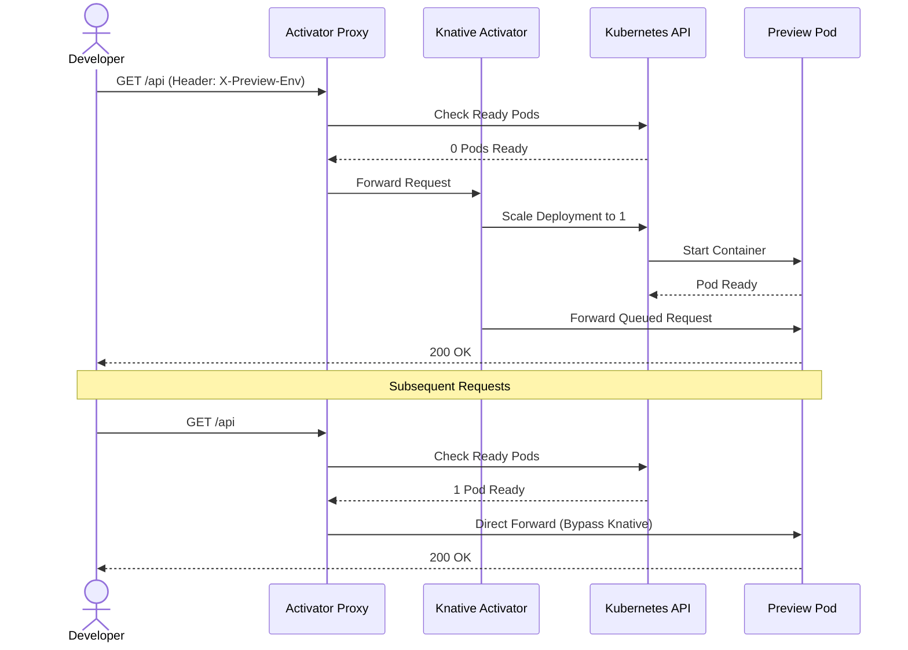

Preview environments are incredibly powerful, but they can be expensive if they run 24/7. Most pull requests are reviewed intermittently—a few minutes of activity followed by hours or days of idle time.

Diverge solves this by allowing your preview environments to **scale to zero** when they aren't receiving traffic.

## Why Scale-to-Zero Matters

- **Massive Cost Savings**: 50 PRs with always-on pods cost ~$1,200/month. With Knative scale-to-zero, that same workload costs ~$15/month *(illustrative estimate based on 50 always-on pods vs. ~3 concurrently active)*.
- **Resource Efficiency**: Fit hundreds of preview environments on a small cluster.
- **Fast Startup**: Previews wake up automatically when a reviewer opens them (startup is typically ~5 seconds, but varies with image size, scheduling, and readiness probe configuration). The Activator buffers requests during startup, though requests may time out if pod startup exceeds the client or proxy request timeout.

## How It Works

Diverge integrates with **Knative Serving** and its own **Activator Proxy** to manage the lifecycle of your pods:

1. **Idle Detection**: Knative monitors traffic to your preview services. When no requests arrive for a configurable period, Knative scales the deployment down to 0 replicas.
2. **Wake Up Flow**: When a new request arrives, it hits the Activator Proxy.
3. **Queue & Scale**: The proxy holds the request, triggers a scale-up of the service to 1 (or more) replicas, and waits for the pod to become ready.
4. **Forward**: Once ready, the proxy forwards the queued request to the newly running pod. Subsequent requests go directly to the pod.

### The Activator Proxy

The **Activator Proxy** is a specialized binary that sits in front of preview environments. 

- **Smart Routing**: Routes to ready pods directly when available to minimize latency.
- **Fallback to Knative**: If pods are scaled to zero, it falls back to the Knative activator to wake the service.
- **Header Injection**: Injects the `X-Preview-Env` header to ensure routing rules continue to work.
- **Efficient State Tracking**: Uses a shared informer to efficiently track pod states across the cluster.

## Sequence Diagram

Here is what happens when a user accesses a scaled-to-zero preview environment:



## Configuration

Diverge supports three deployment modes:
- `local`: Hot reload using a Tailscale WireGuard tunnel to your laptop.
- `image`: Always-on standard Kubernetes deployments.
- `serverless`: Scale-to-zero using Knative Serving.

To enable scale-to-zero for your environments, set the deploy mode to `serverless` in your `.diverge.yaml` (or via PreviewGroup spec):

```yaml
# .diverge.yaml
defaults:
  deploy:
    mode: serverless
```

With this configured, Diverge will automatically generate Knative `Service` resources instead of standard Kubernetes `Deployment` + `Service` pairs. The Activator proxy buffers incoming requests during cold start (typically ~5 seconds, though this varies with container image size, scheduling, and readiness probe completion). If pod initialization exceeds the request timeout, requests may time out.
