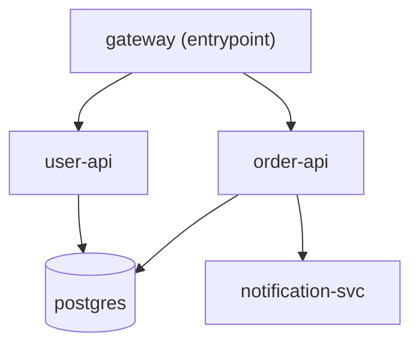

In a microservice architecture, services rarely operate in isolation. Understanding the relationships and request paths between services is essential for effective delta deployments and header-based routing.

Diverge models your architecture as a **Service Topology**—a directed graph of service-to-service dependencies that tracks ingress entrypoints, downstream targets, and communication protocols.

## What is Service Topology?

Service Topology is a directed acyclic graph (DAG) where:
- **Nodes** represent individual microservices, databases, or infrastructure components.
- **Edges** represent directional dependencies or request flows (e.g., Service A calls Service B).
- **Entrypoints** identify ingress-facing services where external requests enter the cluster.

By understanding the full topology, Diverge can reason about how traffic traverses the system and determine the exact impact of changing any individual service.

## Discovery Sources

Diverge can construct and update service topology using multiple discovery sources:

1. **Static Configuration**: Defined directly in your `.diverge.yaml` configuration file using the `dependsOn` and `entrypoint` fields.
2. **Gateway API HTTPRoutes**: Discovered dynamically from Kubernetes Gateway API `HTTPRoute` resources, mapping ingress routing rules and backend references.
3. **Prometheus Service Mesh Telemetry**: Inferred automatically from live service mesh metrics (supporting **Istio**, **Linkerd**, and **Cilium**). Diverge analyzes active request traffic to keep the topology graph up-to-date with runtime reality.

## How Topology Powers Diverge

The topology graph is the foundation for several core Diverge capabilities:

- **Delta Deployments**: Diverge determines which services require isolated preview pods and how to wire fallback routes to the shared baseline environment for unmodified dependencies.
- **Upstream Impact Analysis (`diverge diff`)**: Identifies not only the services modified in your branch or pull request, but also upstream callers that depend on those changes.
- **Route Simulation (`diverge route`)**: Simulates the traversal of requests from entrypoints to target services, verifying header propagation hops and routing correctness before deployment.

## Configuration Example

Below is an example `.diverge.yaml` defining a 5-service architecture with entrypoint configuration and explicit dependencies:

```yaml
version: "1"

services:
  gateway:
    entrypoint: true
    image:
      repository: gateway
      tag_template: "{{ .SHA }}"
    paths:
      - services/gateway
    dependsOn:
      - user-api
      - order-api

  user-api:
    image:
      repository: user-api
      tag_template: "{{ .SHA }}"
    paths:
      - services/user-api
    dependsOn:
      - postgres

  order-api:
    image:
      repository: order-api
      tag_template: "{{ .SHA }}"
    paths:
      - services/order-api
    dependsOn:
      - postgres
      - notification-svc

  notification-svc:
    image:
      repository: notification-svc
      tag_template: "{{ .SHA }}"
    paths:
      - services/notification-svc

  postgres:
    image:
      repository: postgres
      tag_template: "16"
    paths:
      - migrations

defaults:
  routing:
    mode: header
    domain: preview.example.com
  deploy:
    mode: delta
```

## Topology Visualization

The configuration above generates the following dependency graph:



## CLI Commands

The Diverge CLI provides dedicated commands to inspect, validate, and simulate your service topology:

### `diverge graph show`

Display the discovered service topology graph:

```bash
# Output as text tree (default)
diverge graph show

# Output as a Mermaid diagram
diverge graph show --output mermaid

# Output as DOT or JSON
diverge graph show --output dot
diverge graph show --output json

# Filter by a specific gateway
diverge graph show --gateway main-gateway
```

### `diverge graph validate`

Validate the topology graph for configuration issues such as circular dependencies, orphan services, and unreachable nodes:

```bash
diverge graph validate --config .diverge.yaml
```

### `diverge route <service>`

Simulate request routing from entrypoints down to a specific target service:

```bash
# Simulate route to notification-svc
diverge route notification-svc

# Simulate live routing using Prometheus service mesh telemetry
diverge route order-api --live

# Output route simulation as Mermaid
diverge route order-api --output mermaid
```
