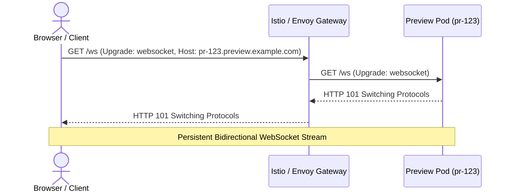

Real-time applications often rely on persistent WebSocket connections for live notifications, chat, streaming data, and collaborative tools.

This document outlines the current state of WebSocket support in Diverge and what is planned on the roadmap.

---

## Current Status

### Gateway-Level Passthrough

The Diverge proxy currently handles **HTTP/1.1** and **HTTP/2** request traffic. However, WebSocket connections (`Upgrade: websocket`) work seamlessly when using an underlying ingress gateway such as **Istio Ingress Gateway** or **Envoy Gateway**:

- **Native Envoy / Istio Handling**: Istio and Envoy Gateway support WebSocket upgrade requests natively without additional configuration.
- **Subdomain Routing for WebSockets**: When using `mode: subdomain` (e.g., `https://pr-123.preview.example.com`), WebSocket connection handshakes are routed directly to the preview service based on the `Host` header.
- **Baseline Passthrough**: If a preview environment does not modify the WebSocket service, connections route directly to the baseline deployment.

---

## Roadmap: Dedicated Diverge WebSocket Proxying

Dedicated Diverge-side WebSocket proxying is actively on the roadmap to provide richer preview routing capabilities for header-based environments:

- **Header Injection on Handshake**: Enabling the Diverge proxy to intercept initial HTTP Upgrade handshakes, inspect preview headers (`x-diverge-env`), and dynamically bind the resulting bidirectional tunnel to ephemeral delta preview pods.
- **Session Stickiness**: Ensuring long-lived WebSocket sessions remain pinned to specific preview revisions during hot-reloads and container redeployments.
- **Scale-to-Zero Activator Integration**: Waking scaled-to-zero preview pods upon receiving an incoming WebSocket handshake request, buffering the connection until the pod becomes ready.
- **Query Parameter Routing**: Supporting fallback routing keys in WebSocket query parameters (e.g., `wss://api.example.com/ws?diverge_env=pr-123`) for clients that cannot attach custom headers during the browser `new WebSocket(url)` constructor call.

---

## Recommended Practice Today

If your preview environment requires WebSocket communication:

1. **Use Subdomain Routing**: Configure `mode: subdomain` in your `Environment` CRD or `.diverge.yaml`. This routes the initial HTTP Upgrade handshake based on the hostname without requiring custom header injection in the browser.
2. **Ensure Gateway Upgrade Support**: Verify that your Gateway API `HTTPRoute` or Istio `VirtualService` allows upgrade requests (enabled by default in modern Envoy Gateway and Istio distributions).
